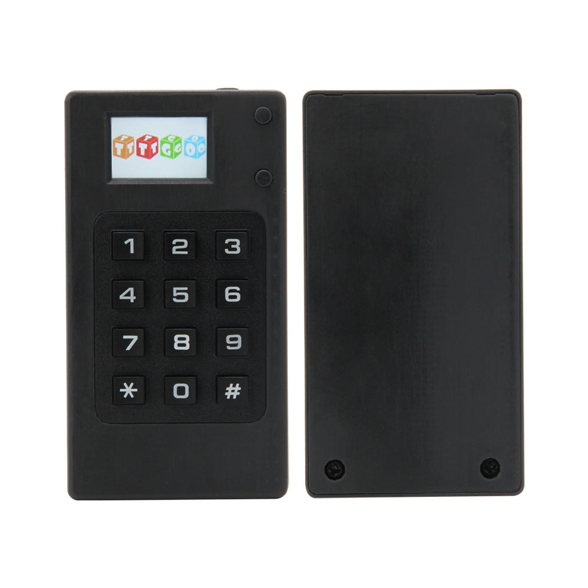
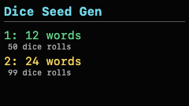
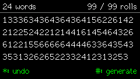
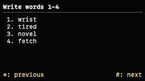
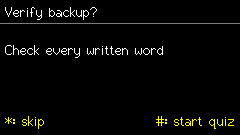
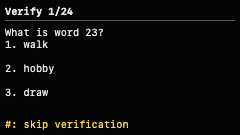

# LilyGO T-Display Dice Seed

Offline [BIP39](https://github.com/bitcoin/bips/blob/master/bip-0039.mediawiki) English mnemonic generator for the LilyGO TTGO T-Display with the LilyGO 4x3 keyboard module.

<p align="center">
  <a href="https://lilygo.cc/products/t-display-keyboard"></a>
</p>

<p align="center"><sub>Official product image from <a href="https://lilygo.cc/products/t-display-keyboard">LilyGO</a>.</sub></p>

The firmware uses the same deterministic dice construction as [SeedSigner](https://seedsigner.com/) and [Coldcard](https://coldcard.com/)'s dedicated dice-only flow:

- 12 words: exactly 50 rolls, `SHA256(ASCII rolls)` truncated to 16 bytes.
- 24 words: exactly 99 rolls, full `SHA256(ASCII rolls)` digest.

It does not use the [ESP32](https://docs.espressif.com/projects/esp-idf/en/latest/esp32/) RNG, convert dice to base 6, store seed material, enable networking, or log seed material to serial output.

## Security Model

This is a dedicated, offline dice-to-BIP39 generator, not a tamper-resistant hardware wallet or secure element.

- Build and flash it from a trusted host, then disconnect USB before entering real rolls.
- Use fair, private dice. Keep the roll record private and do not photograph, share, or reuse it.
- Power loss, reset, and cancellation clear the in-progress session. Keep private roll notes until the written mnemonic has passed verification, then destroy them.
- The ESP32 and its USB flashing path cannot protect against compromised firmware, a compromised build host, or physical access to the device.
- A BIP39 mnemonic is not a complete wallet backup. Separately record the wallet software/type, derivation path or account, and any BIP39 passphrase. Never store these on this device.

## Screens

Screens below are rendered from the local WebAssembly simulator using the public 99-roll test vector from this project's article.

<p align="center">
  
  
</p>

<p align="center">
  
  
  
</p>

## Hardware

- [LilyGO TTGO T-Display](https://lilygo.cc/products/t-display) ESP32 with ST7789 display.
- [LilyGO T-Display keyboard](https://lilygo.cc/products/t-display-keyboard) 4x3 keyboard module.
- Keypad rows: GPIO `21`, `27`, `26`, `22`.
- Keypad columns: GPIO `33`, `32`, `25`.

## Controls

**Select length**

`1` selects a 12-word mnemonic with 50 rolls. `2` selects a 24-word mnemonic with 99 rolls. The next screen requires acknowledgement that the dice must be fair and private and that a reset clears the session.

**Enter dice rolls**

`1` through `6` enter die faces. `*` removes the latest roll. Before the required count, `#` cancels to the main menu. At exactly 50 or 99 rolls, `#` generates the mnemonic immediately. Fifty fair d6 rolls provide about 129 bits of input entropy; 99 provide about 256 bits.

**Review mnemonic**

Each mnemonic word is shown individually in a large font. `*` shows the previous word and `#` shows the next. On the first word, `*` returns to the completed roll grid. After the final word, `#` opens the backup-verification prompt.

**Verify backup**

Each of the 12 or 24 words is tested in shuffled order. Select one of three choices with `1` through `3`. `#` opens the skip confirmation; there, `*` resumes verification and `#` skips it. After completion or a confirmed skip, `#` clears sensitive memory and returns to the main menu.

## Build

The build script installs Arduino-ESP32 `3.3.11`, `Keypad@3.1.1`, and `TFT_eSPI@2.5.43`, then configures the display driver for the T-Display pins.

```sh
git clone https://github.com/schjonhaug/lilygo-tdisplay-dice-seed.git
cd lilygo-tdisplay-dice-seed
./tests/run.sh
./build.sh
arduino-cli board list
arduino-cli upload --fqbn esp32:esp32:ttgo-lora32 --input-dir build --port <port> --upload-property upload.speed=115200
```

Install [Arduino CLI](https://arduino.github.io/arduino-cli/latest/installation/) before building. Use the port reported by `arduino-cli board list`; on macOS it is commonly `/dev/cu.usbserial-XXXX`.

## Verification

The test suite checks these public compatibility vectors:

- Three 50-roll SeedSigner vectors: a mixed sequence, all `1`s, and all `6`s.
- Three known 99-roll SeedSigner vectors.
- A 99-roll all-`1` vector published by [Krux](https://github.com/selfcustody/krux/blob/main/tests/pages/new_mnemonic/test_dice_rolls.py).
- The public 99-roll test sequence and mnemonic from [Why Dice-Only Coldcard Seeds Were Unaffected by the RNG Bug](https://schjonhaug.dev/articles/why-dice-only-coldcard-seeds-were-unaffected-by-the-rng-bug/), independently checked on SeedSigner and Coldcard.

For an independent check, run SeedSigner locally or use an offline copy of [Ian Coleman's BIP39 tool](https://github.com/iancoleman/bip39) with entropy interpreted as `Base 10 [0-9]` or `Hex [0-9A-F]`, not `Dice [1-6]`.

## References

- [SeedSigner dice verification guide](https://github.com/SeedSigner/seedsigner/blob/main/docs/dice_verification.md)
- [Coldcard dice-roll math](https://coldcard.com/docs/verifying-dice-roll-math)
- [Why Dice-Only Coldcard Seeds Were Unaffected by the RNG Bug](https://schjonhaug.dev/articles/why-dice-only-coldcard-seeds-were-unaffected-by-the-rng-bug/)

## Local Simulator

Use the terminal simulator to verify public test data against the exact firmware mnemonic logic before flashing the device:

```sh
./tools/run-local.sh 133363436436436415622614221225242212144161454643266122155666664444633643543353132626522332412313253
```

It prints the 24 public words from the article. Do not pass real dice rolls to this command: command-line arguments can be saved in shell history and visible to other local processes.

For a visual simulation of the display and keypad, build the WebAssembly module and serve the simulator locally:

```sh
brew install emscripten # or install Emscripten by another method
./tools/build-wasm.sh
node tests/test_wasm.mjs
./tools/serve-simulator.sh
```

Open `http://localhost:8000`, click `Load public 99-roll article vector`, then press `#` to view the words. The browser simulator is only for public vectors and UI review; its input handling, session state, quiz, mnemonic generation, and word lookup are shared C++ compiled to WASM. The WASM test checks mnemonic vectors and shared-session transitions.

To regenerate the README screenshots:

```sh
./tools/capture-screenshots.sh
```
